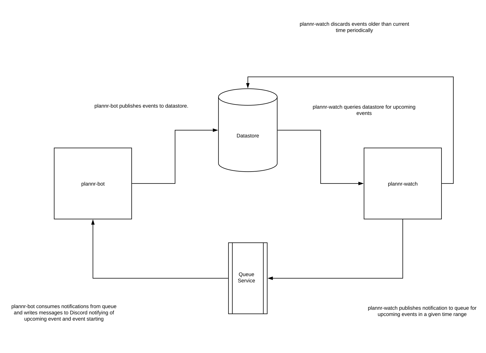

## Plannr Bot Architecture

Plannr Bot ultimately is made up of two service plannr-bot and [plannr-watch](https://github.com/rpmcdougall/plannr-watch). These two services interact with a queue to maintain scheduled events and provide a mechanism for notification of when an upcoming event is about to occur within a given time frame.

The below diagram shows and explains the flow of events and data from when an event request comes in from Discord.

